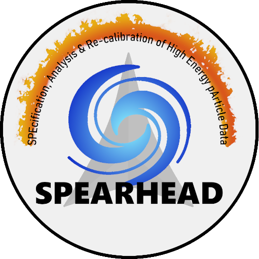

# SPEARHEAD

 

_SPEcification, Analysis & Re-calibration of High Energy pArticle Data_ (SPEARHEAD) is an EU-funded project that through a detailed analysis of very high-energy particle observations from the most important heliophysics missions combined with ground based measurements aims to answer three science questions:

1. How are protons accelerated beyond 100 MeV and electrons beyond 1 MeV in solar eruptions?
2. What are the release times and spectral characteristics of near-relativistic particles from solar eruptions?
3. How do coronal and interplanetary structures affect the transport processes of very high energetic particles?

To enable the scientific data analysis, SPEARHEAD has three technical objectives:

1. Determining the response functions of a large number of spacecraft instruments to derive high-energy particle fluxes from observations at unprecedented accuracy releasing revised and completely new datasets
2. Performing cross-calibration of datasets measured by science-grade and monitoring instruments to enable the use of monitoring data for scientific analyses
3. Combining high-energy particle and context observations together with modeling of plasma structures for easier in-depth analysis of solar eruptions, quantifying their effect and delivering them to the community

 

_This project has received funding from the European Union’s Horizon Europe programme under grant agreement No 101135044. This website reflects only the authors’ view and the European Commission is not responsible for any use that may be made of the information it contains._
